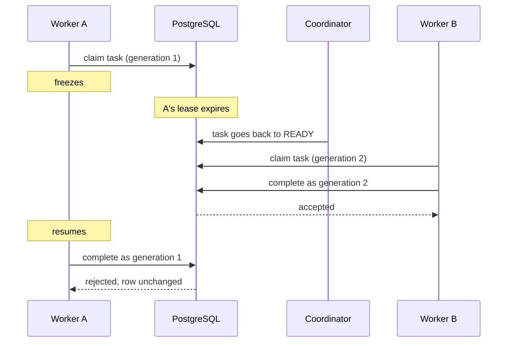

# Durable Runner

Durable Runner is a PostgreSQL-backed task runtime built around one
question: what happens to a job if the worker running it disappears halfway
through?

Retrying it is easy. The harder case is when the worker didn't actually die.
It froze, its lease expired, another worker took over, and then the old
worker woke back up and tried to finish the same job. From its point of view
nothing happened. It still has the task in memory, it still thinks it owns
it, and it's about to write a result.

A dead worker is simple. A worker that only *looks* dead is the case that
corrupts state. I built Durable Runner to find out what reliable execution
actually takes once workers can crash, freeze, retry, and come back after
losing ownership. I ended up with three separate mechanisms:

- **Leases.** Claiming a task gives a worker a time-limited lease, which it
  renews while it works. If the lease runs out, the task can be claimed again.
- **Generation fencing.** Every claim increments the task's `lease_version`.
  Every write a worker makes to the task has to carry the generation it
  claimed with, so a worker that comes back holding an old generation can't
  touch the new owner's state.
- **Idempotency.** Fencing fixes the workflow state, but not the side effect.
  If the old worker already sent something before it froze, the rerun uses a
  stable key to reuse that result instead of doing it again.

Workers are independent Node.js processes. PostgreSQL is the only thing they
share, and all claiming, recovery and coordination happens through rows in
it. Execution is at least once, and the rest of the system is designed around
that.

## The stale-worker case

This is the scenario the whole project is organized around, and
`npm run demo:fencing` runs it with real processes:

1. Worker A claims a task at generation 1.
2. A freezes (the demo sends it `SIGSTOP`).
3. A's lease deadline passes.
4. The coordinator notices the expired lease and puts the task back to `READY`.
5. Worker B claims it at generation 2 and completes it.
6. A resumes (`SIGCONT`), finishes its work, and tries to complete as generation 1.
7. PostgreSQL rejects the write, and the row doesn't change.



Nobody tells A that it lost the task, and nothing cancels its executor. It
runs to the end, and the only thing stopping it is that the database won't
accept its write. The check also has to be on the generation, not the worker
ID. IDs get reused across restarts, so "is this still worker-a?" can say yes
to a stale process. The fencing tests cover exactly that: same worker ID,
older generation, rejected.

## How it's put together

- **PostgreSQL** holds all durable state and is the only coordination
  mechanism. There's no broker, cache, or lock service, and the processes
  never talk to each other directly.
- **Workers** (`npm run worker`) are separate Node OS processes. Each one
  polls for work, runs one task at a time, renews its lease while the task
  runs, and then records success or failure.
- **The coordinator** (`npm run coordinator`) is its own process. Once a
  second it returns expired leases to `READY` and moves retries whose backoff
  has elapsed back to `READY`. It never decides who owns a task. If it's
  down, recovery is late, but nobody gains authority they shouldn't have.
- **The API** is a Fastify server, and its HTTP surface is intentionally
  small: a health check, plus durable event history over REST and
  Server-Sent Events. The React/Vite frontend is currently a diagnostic page
  showing health and the live event feed.

Workers claim tasks with `SELECT ... FOR UPDATE SKIP LOCKED`, followed by an
`UPDATE` that sets the owner, increments `lease_version` and `attempt_count`,
and sets the lease deadline. It all happens in one transaction. `SKIP LOCKED`
makes a claimer pass over rows another claimer has locked instead of waiting
on them, so many workers can claim at once without getting the same row.
Every status change is checked against one transition table in
[`step-transitions.ts`](server/src/domain/step-transitions.ts).

Everything so far has been validated with independent OS processes on one
machine sharing one PostgreSQL instance. I haven't tested workers on
separate machines.

## Heartbeats, leases, generations, attempts

These four are easy to blur together, and the design depends on keeping them
apart:

- A **heartbeat** (every 2s) means the process appears to be alive. It's
  only for observability, and no ownership decision reads it.
- A **lease** (30s, renewed every 5s) means this worker currently has
  authority over this specific task, until a deadline on the database clock.
- **`lease_version`** is the ownership generation, used as the fencing token.
  It changes only when a task is claimed, and it never resets.
- **`attempt_count`** is how much of the task's execution budget has been
  used. It also goes up on each claim, but it answers "how many tries?", not
  "who owns this?"

An owner's write has to pass both a deadline check and a generation check,
and they catch different things. Before recovery runs, a lapsed owner still
holds the right generation, and only the deadline stops it. After someone
else reclaims the task, the deadline on the row belongs to the new owner, so
only the generation stops the old one. All the time comparisons use
PostgreSQL's `clock_timestamp()`. Worker clocks decide when to *try* a
write, and the database decides whether it's allowed.

## The PostgreSQL race I didn't expect

I originally wrote renewal and completion as single guarded `UPDATE`s, with
status, owner, generation and "lease still live" all in the `WHERE` clause.
While testing lease races on PostgreSQL 16.15 under READ COMMITTED, I had
another transaction hold the row with a plain `SELECT ... FOR UPDATE` until
the lease deadline had passed. The renewal waiting behind it went through
and extended a lease that had already expired. The `UPDATE` had evaluated its
predicate before blocking. After the wait, PostgreSQL only re-checks the
predicate if the lock holder actually modified the row, and a lock-only
holder hadn't.

So every ownership-sensitive write (renewal, completion, failure reporting)
now locks the row first with `SELECT ... FOR UPDATE`, and only then runs the
`UPDATE` with the full predicate. That second statement gets a fresh
snapshot, so it sees whatever happened during the wait. The cost is extra
round trips while holding the row lock. `lease-races.test.ts` reproduces the
original bug and fails if either path goes back to a single statement. The
full reasoning is in [ADR 0001](docs/decisions/0001-lease-deadline-is-authority.md).

## Retries and dead-lettering

```text
RUNNING -> RETRY_WAIT -> READY -> RUNNING ...     (budget left)
RUNNING -> DEAD_LETTERED                          (budget exhausted)
```

When an executor throws, the worker reports the failure through the same
lock-first, generation-checked transaction. If budget is left, the task
waits out a backoff of `min(500ms * 2^(attempt - 1), 4s)` in `RETRY_WAIT`
before the coordinator makes it `READY` again. The default is 3 attempts in
total. Invalid input dead-letters immediately.

A claim counts as an attempt even if the worker crashes before running
anything, so crashes use up the budget too. A worker that crashes on the
last attempt sends the task straight from `RUNNING` to `DEAD_LETTERED` when
its lease expires. [ADR 0002](docs/decisions/0002-attempt-budget-includes-crashes.md)
explains why I went with that.

`npm run demo:retries` shows both outcomes with real processes. One task
fails twice and succeeds on attempt 3, and a poison task fails all three
times and dead-letters.

## Fencing is not idempotency

Fencing protects Durable Runner's own workflow state from a superseded
worker. It doesn't undo anything the worker already did. If A sent an email
before it froze, rejecting A's database write doesn't unsend it, and when B
reruns the task it will try to send it again.

To show the fix without pretending to integrate a real third-party API, the
repo has a controlled effect sink: an `idempotent_effects` table in
PostgreSQL where inserting a row *is* the effect (a receipt). Each logical
step gets a stable key derived from its own ID. Attempt number, generation
and worker never go into it. Applying the effect is
`INSERT ... ON CONFLICT DO NOTHING`, and a conflict returns the stored
result. The effect commits in its own transaction, separate from step
completion. That separation is on purpose, because it keeps the dangerous
window open: effect committed, worker gone, completion never written.

`npm run demo:idempotency` runs that window:

```text
A claims v1, applies effect K        -> receipt committed
A is frozen before completing
lease expires, coordinator recovers
B claims v2, requests effect K       -> gets A's stored receipt
B completes as v2
A resumes, completes as v1           -> rejected by fencing
final: 1 receipt, 1 succeeded step, 2 executions
```

Running one logical step more than once creates at most one receipt in the
controlled PostgreSQL effect sink, while stale workflow writes from
superseded ownership generations are rejected. That only works because the
effect and its idempotency record are the same row. A real external API
would need its own idempotency contract. The sink also doesn't check
ownership, so a stale worker can still be the one that applies the effect
first.

## Durable events

Every lifecycle transition (claimed, succeeded, retry scheduled,
dead-lettered, lease recovered, retry ready) writes a `step_events` row in
the same transaction as the state change. The history can't disagree with
the state. `steps` stays the authoritative state, though. Events are history
for observability, and this is not event sourcing. The API serves them from
`GET /api/events` and streams them over SSE at `/api/events/stream`, using
the event ID as the SSE `id` so a browser can resume after reconnecting.

The tricky part was the cursor. `WHERE id > $lastSeen` looks right, but IDs
are allocated at insert and become visible at commit, and those orders
differ. A reader can move past an ID whose transaction hasn't committed yet
and then never see it. So each event also records its transaction ID, and
reads only return events from transactions older than the oldest one still
running. [ADR 0003](docs/decisions/0003-event-cursor-watermark.md) has the
reproduction and the alternatives.

## Benchmarks

All numbers come from one approved run of `npm run bench` against commit
`3cbb858`. The machine was an Apple M2 laptop (8 logical cores, 16 GiB),
running Node 20.19.4 and PostgreSQL 16.15, with the database, workers and
coordinator all on the same machine. `fsync` and `synchronous_commit` were
on, and every transition wrote its normal durable event. The full report is
[here](benchmarks/results/2026-09-19T01-14-28-972Z_3cbb858.md).

**Backlog throughput.** Each configuration drained 50,000 tasks three times.
The table shows the median run.

| Worker processes | Median tasks/s | Spread across 3 runs |
|---|---|---|
| 1 | **1,205.4** | 2.6% |
| 3 | **2,782.7** | 5.0% |
| 8 | **3,277.1** | 3.8% |

Every task in every run succeeded. These numbers describe this one machine,
not how the design scales beyond it.

I care more about the failure tests than the raw throughput:

- **200,266** successful concurrent ownership grants, with **0** duplicate
  grants.
- **4,750** deliberately stale renewals, completions and failure reports,
  with **0** accepted and **0** final-state corruption.
- **45,000** executions across **5,000** logical keys produced exactly
  **5,000** effect rows, with **0** duplicate logical effects.

**Paced arrivals.** With 8 workers and 1,600 tasks/s submitted, end-to-end
latency was about **257 ms p50, 501 ms p95 and 525 ms p99**. Claim to
completion took about **1.1 ms p50** and about **5 ms p99**. So nearly all of
the end-to-end time is spent before a worker claims the task, and that fits
with idle workers polling every 500 ms. Once a task is claimed, finishing it
takes about a millisecond.

## Tests and demos

The suite has **203 tests across 18 files**, all against a real PostgreSQL.
They cover concurrent claiming, completion authorization, lease renewal,
expiry and recovery, fencing (including a reused worker ID), races between
owners and the recovery sweep, retries and dead-lettering, idempotent
effects under concurrency, event atomicity and the cursor, the events
API/SSE, and worker heartbeats and loop behavior. Several of them were
checked against deliberately broken code, for example dropping `SKIP LOCKED`
or the version guard, to confirm they fail.

The tests run concurrent actors as separate connections inside one process.
The demos use real child processes and check their results from PostgreSQL:

| Command | What it shows |
|---|---|
| `npm run demo:recovery` | worker `SIGKILL`ed mid-task, lease expires, task reclaimed at generation 2 |
| `npm run demo:fencing` | the frozen-worker sequence above, using `SIGSTOP`/`SIGCONT` |
| `npm run demo:retries` | retry until success, and a poison task that dead-letters |
| `npm run demo:idempotency` | one receipt across two executions (`-- --kill` kills the worker instead of freezing it) |

The fencing and idempotency demos pause and resume processes with Unix
signals and read process state with `ps`, so they need macOS or Linux. They
use the real 30s lease, so expect about a minute each.

## What it guarantees, and what it doesn't

Durable Runner gives you at-least-once execution, leased ownership, crash
recovery, stale-generation fencing on task writes, bounded retries with
dead-lettering, at most one receipt per logical step in the controlled
PostgreSQL sink, and durable event history, all across independent Node
processes that share nothing but PostgreSQL.

It does not provide:

- **Exactly-once execution.** Tasks can and do run more than once.
- **Exactly-once effects against third-party systems.** The idempotency
  guarantee covers the PostgreSQL sink in this repo only.
- **Cancellation of stale computation.** A worker that lost its lease keeps
  running. Only its writes are rejected.
- **Distributed transactions.** Effect and completion are separate
  transactions by design.
- **Guaranteed eventual success.** Tasks can dead-letter, including from
  crashes alone.
- **Validated multi-machine or production-scale behavior.** Everything here
  ran on one machine.

It also assumes the database clock doesn't jump backward across an expired
deadline, and it won't take a lease away from a worker that keeps renewing
but stops making progress.

## Running it locally

You'll need Node 20.12+ and PostgreSQL (I've tested against 16).

```bash
npm install
cp .env.example .env         # point DATABASE_URL at your database
createdb durable_runner      # match the name/port in DATABASE_URL
npm run db:migrate
npm test                     # note: clears rows in the DATABASE_URL database
```

To run the pieces yourself, start each of these in its own terminal:

```bash
npm run dev:server           # API on :3000
npm run dev:web              # frontend, proxies /api to :3000
npm run coordinator
npm run worker -- worker-1
```

Tasks are currently inserted by the demos, tests and benchmark rather than
submitted over HTTP. `npm run demo:workers` inserts a few and runs three
workers over them. Stop any workers or coordinator you started yourself
before running the other demos. Each demo starts its own processes and
refuses to run if there's unrelated unfinished work in the database.

**Benchmark.** `npm run bench` takes about 15 minutes, and
`npm run bench -- --quick` is a shorter smoke run. The harness creates its
own `<database>_bench` database, so your role needs `CREATE DATABASE`. It's
deliberately picky and refuses to measure when the load average is above the
core count. Its power and memory-pressure checks (battery, Low Power Mode,
low free memory) use macOS tools and are skipped elsewhere, so the full
benchmark workflow currently targets macOS. Details are in
[`benchmarks/README.md`](benchmarks/README.md).

## Where to look

- [`server/src/db/`](server/src/db/): the SQL that matters (claim, renew,
  complete, fail, recover, effects, events)
- [`server/src/worker/`](server/src/worker/): the worker loop, the
  executor, and the demos
- [`server/tests/`](server/tests/): integration tests against real PostgreSQL
- [`docs/architecture.md`](docs/architecture.md): every mechanism in detail
- [`docs/decisions/`](docs/decisions/): ADRs for the three hardest calls
- [`docs/build-journal.md`](docs/build-journal.md): the experiments behind them
