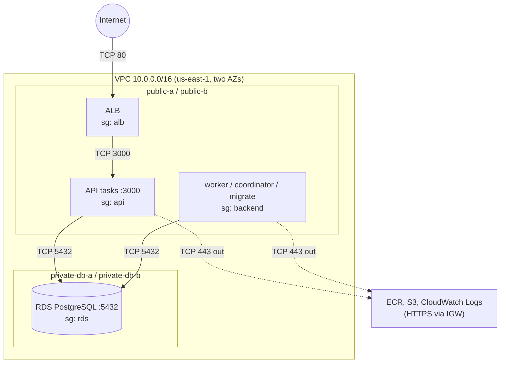

# Cloud architecture (AWS)

How Durable Runner is meant to run on AWS, and how much of that exists.
The distributed-execution design itself (claiming, leases, fencing, retries,
events) is in [architecture.md](architecture.md) and doesn't change here.

## Status

| Layer | Planned | Defined in Terraform (`infra/`) | Deployed |
|---|---|---|---|
| VPC, 4 subnets, IGW, route tables | yes | yes | **yes**, verified 2026-09-24 |
| Security groups (alb, api, backend, rds) | yes | yes | **yes**, verified 2026-09-24 |
| ECR repository `durable-runner` | yes | yes | **yes**; one Git-SHA-tagged image pushed 2026-09-26 |
| Budget alerts (filtered to `Project` tag) | yes | yes (`enable_budget = true` in local tfvars) | **yes**, verified 2026-09-25 |
| ECS cluster, execution role, log group, migration task definition | yes | yes (`ecs.tf`) | **yes**, control plane verified 2026-09-26; migration task **runtime verified** 2026-09-26 |
| ALB, Fargate API / worker / coordinator services | yes | yes (`services.tf`, behind `enable_services`; not applied) | **no** |
| RDS DB subnet group (private DB subnets) | yes | yes (`rds.tf`, always present) | **yes**, verified 2026-09-25 |
| RDS PostgreSQL 16 instance (`db.t4g.micro`, private) | yes | yes (`rds.tf`, behind `enable_database`) | **yes**, control plane verified 2026-09-25; TLS SQL connectivity from Fargate **runtime verified** 2026-09-26 |
| TLS (ACM), DNS (Route 53), CI/CD | later | no | no |

On 2026-09-24 the reviewed plan was applied: 29 added, 0 changed, 0
destroyed. The result was then checked directly with the AWS CLI rather than
trusted from Terraform's output. That covered VPC attributes, the subnets
and their AZs, the IGW attachment, every route, every security-group rule,
ECR settings and tags. An immediate re-plan reported no changes. The two AZs
are `us-east-1a` (`use1-az2`) and `us-east-1b` (`use1-az4`). `terraform
output` (run in `infra/`) prints the resource IDs.

Since 2026-09-25 the RDS instance runs here (see below). It has one
network interface, with private address `10.0.11.44` and no public IP.
Since 2026-09-26 one-off Fargate migration tasks have run in the backend
security group and reached it (see
[Migration task](#migration-task-phase-2d-runtime-verified)). No ALB and no
long-running service exist yet, so the alb and api security groups still
only define *who would be allowed*.

AWS also created the VPC's *main* route table automatically. Terraform
doesn't manage it, and no subnet uses it; it contains only the local
route.

On 2026-09-25 the `Project` cost allocation tag was activated and the
project-scoped budget applied as a one-resource plan (1 added, 0 changed, 0
destroyed). `aws budgets` shows the filter, limit and three notifications
as configured, and a re-plan reported no changes. With that, the Phase 2A
foundation (network, security groups, ECR and cost guardrail) is complete.

## Target shape



One container image runs every role. The command chosen at launch decides
whether a task is the API, a worker, the coordinator or a one-off migration.

## Network

Region `us-east-1`. VPC `10.0.0.0/16`, DNS support and DNS hostnames on.

| Subnet | CIDR | AZ | Route table | Will hold |
|---|---|---|---|---|
| public-a | 10.0.0.0/24 | 1st standard AZ | public | ALB node, Fargate task ENIs |
| public-b | 10.0.1.0/24 | 2nd standard AZ | public | ALB node, Fargate task ENIs |
| private-db-a | 10.0.10.0/24 | 1st standard AZ | private-db | RDS |
| private-db-b | 10.0.11.0/24 | 2nd standard AZ | private-db | RDS (standby / subnet-group requirement) |

Route tables:

- **public**: `10.0.0.0/16 → local`, `0.0.0.0/0 → internet gateway`.
- **private-db**: `10.0.0.0/16 → local` only.

The two AZs are the first two *standard* zones in the region, sorted by name
(`locals.tf`). They're filtered only on opt-in status, not on "currently
available", so an AZ incident can't reshuffle the list and make Terraform
plan to rebuild subnets. AZ names map to different physical zones in each
account; the plan output shows which names were picked.

### What each piece does

- **VPC**: a private address space (`10.0.0.0/16`, 65,536 addresses) that
  nothing outside can reach unless something inside is given a route and
  permission. Everything else here lives inside it.
- **Subnet**: a slice of that range pinned to one availability zone. Its
  behavior comes from the route table it's associated with, not from its
  name.
- **Two AZs**: an AZ is one or more separate data centers. An ALB must have
  subnets in at least two AZs, and an RDS subnet group must span at least
  two, even for a single-AZ database. It also means losing one zone doesn't
  take out the whole network layout. Each tier therefore gets one subnet per
  AZ.
- **Internet Gateway**: the VPC's single door to the internet. It also
  translates between a resource's private address and its public IPv4
  address. It does nothing for a subnet whose route table doesn't point at
  it.
- **Route tables**: they answer "where does a packet to address X go?" A
  subnet is **public** only because its table has `0.0.0.0/0 → IGW`.
- **Why private-db has no default route**: without a route, the database
  subnets have no internet path in either direction, whatever any security
  group says. The database only needs the VPC-local route to hear from the
  tasks. It is explicitly associated with its own table rather than the VPC
  main table, so a route later added to the main table can't leak into it.

## Security groups

Security groups are stateful allowlists attached to network interfaces.
Routing decides whether a packet *can* get somewhere; the security group
decides whether the receiving (or sending) interface *accepts* it. Both
have to allow it.

| Group | Inbound | Outbound |
|---|---|---|
| alb | TCP 80 from `0.0.0.0/0` | TCP 3000 to **api** |
| api | TCP 3000 from **alb** | TCP 443 to `0.0.0.0/0`; TCP 5432 to **rds** |
| backend | *none* | TCP 443 to `0.0.0.0/0`; TCP 5432 to **rds** |
| rds | TCP 5432 from **api**; TCP 5432 from **backend** | *none* |
| VPC default | *none* (rules removed) | *none* |

Bold names are security-group references: "any interface that belongs to
that group". That expresses the trust boundary directly. Only our tasks can
reach PostgreSQL, and only the ALB can reach port 3000. By contrast,
`10.0.0.0/16` would also admit the ALB or anything added to the VPC later,
and a CIDR can't follow tasks whose IPs change on every deployment.

**Public IP ≠ publicly reachable.** Fargate tasks in the public subnets
will get public IPv4 addresses so they can reach ECR and CloudWatch Logs.
Inbound, a packet from the internet to a task on port 3000 is routed there,
but the api group only accepts 3000 from the alb group, so it's dropped.
Backend tasks accept nothing inbound at all.

**Outbound 443 to anywhere** is deliberate. Without a NAT Gateway or VPC
endpoints, tasks reach AWS service endpoints (ECR API, the S3 buckets behind
image layers, CloudWatch Logs) over the internet. Those endpoints' IP
ranges are large and change, so pinning them isn't practical. The
application itself calls nothing but PostgreSQL. DNS queries to the VPC
resolver aren't filtered by security groups.

**Migrations** run as a one-off task with the **backend** group: they need
PostgreSQL and serve nothing.

## Why public subnets for Fargate, and no NAT Gateway

The textbook layout puts tasks in private subnets behind a NAT Gateway. A
NAT Gateway costs about $0.045/hour (roughly $33/month) plus $0.045 per GB
processed, per AZ, before any traffic. For three small tasks, public IPv4
addresses at $0.005/hour each (about $3.65/month) are much cheaper. The
security groups above keep inbound access exactly as closed as it would be
behind a NAT. What's given up is defense in depth: in this layout a single
security-group mistake exposes a task, whereas behind a NAT it wouldn't.
Moving tasks to private subnets later means adding private app subnets plus
a NAT Gateway or VPC endpoints.

## Why RDS is private

The database holds all task state and is the only thing every process talks
to. It sits in subnets with no internet route, accepts only 5432 from the
api and backend groups, and gets no public address. There's no rule for a
laptop; reaching it for debugging will go through a task inside the VPC.

## RDS PostgreSQL (deployed; reached from Fargate over verified TLS)

`infra/rds.tf` defines one instance and its DB subnet group. On 2026-09-25
the reviewed saved plan was applied: 2 added (`aws_db_subnet_group.main`,
`aws_db_instance.main[0]`), 0 changed, 0 destroyed. The instance took about
7 minutes to become available. It was then checked with the AWS CLI, and
an immediate re-plan reported no changes.

What AWS reports:

- `durable-runner-dev`: PostgreSQL **16.13** (RDS's default 16.x;
  `engine_version = "16"` doesn't drift against it), `db.t4g.micro`,
  single-AZ in **us-east-1b** (`private-db-b`).
- 20 GiB gp3 at the 3000 IOPS / 125 MiB/s baseline, encrypted with
  `alias/aws/rds` (AWS-managed).
- `PubliclyAccessible = false`. Its one network interface has private IP
  `10.0.11.44` and no public IP. The endpoint hostname resolves to that
  private address.
- Subnet group: exactly `private-db-a` and `private-db-b`, whose route table
  has only the local route.
- Only the `rds` security group. It admits 5432 only from the api and
  backend groups, and no rule in the VPC opens 5432 to the internet.
- 1-day backups, deletion protection off, automatic minor upgrades on,
  default `postgres16` parameter group (`rds.force_ssl = 1`), CA
  `rds-ca-rsa2048-g1`.
- Managed master secret `rds!db-…`: owned by RDS, rotated every 7 days,
  encrypted with `alias/aws/secretsmanager`. Its value was never read. The
  Terraform state holds only the ARN, with no password or URL.

SQL connectivity was verified on 2026-09-26 from one-off Fargate tasks in
the backend security group; see
[Migration task](#migration-task-phase-2d-runtime-verified). No client
outside the VPC has connected, and none can.

| Setting | Value | Why |
|---|---|---|
| Engine | PostgreSQL, `engine_version = "16"` with auto minor upgrades | Local development and the benchmarks use 16. Specifying only the major version lets RDS pick its default minor (16.13 at planning time; 16.3–16.15 were available) and apply later minors without Terraform drift. `engine_version_actual` reports what's running. |
| Class | `db.t4g.micro` (2 burstable vCPUs, 1 GiB) | Orderable for 16.x in both of our AZs. It's the smallest Graviton class. |
| Availability | single-AZ | The two-AZ subnet group is an RDS requirement, not a standby. |
| Storage | 20 GiB gp3 (baseline 3000 IOPS / 125 MiB/s), autoscaling off | gp3 minimum; storage and its cost can't grow on their own. |
| Encryption | on, AWS-managed `aws/rds` key | No customer-managed KMS key. |
| Database / admin user | `durable_runner` / `durable_runner_admin` | The admin name is distinct from the database name and isn't `postgres`. |
| Credentials | `manage_master_user_password = true` | RDS generates the password into a Secrets Manager secret it owns. No password in config, tfvars, state or outputs; state holds only the secret's ARN. Rotated every 7 days by default. |
| Network | DB subnet group = the two private DB subnets; `rds` security group only; `publicly_accessible = false` | See below. |
| Backups | 1 day | Point-in-time restore for the length of an experiment. Backup storage up to the provisioned size carries no extra charge. |
| Teardown | `deletion_protection = false`, `skip_final_snapshot = true`, automated backups deleted with the instance | Built for create → test → destroy. **Not** production defaults: a real database would keep deletion protection and a final snapshot. |
| Extras | no Multi-AZ, Enhanced Monitoring, Performance Insights, RDS Proxy or replicas | No current requirement. |

**A DNS name doesn't mean it's public.** The instance gets a hostname like
`durable-runner-dev.xxxx.us-east-1.rds.amazonaws.com`. With
`publicly_accessible = false` it resolves only to a private `10.0.x.x`
address in a DB subnet. That address has no internet route, and the `rds`
group admits 5432 only from the `api` and `backend` groups. Anyone can
resolve the name, but only our tasks can connect.

**How tasks connect: separate `DB_*` variables, not a URL.** Locally the
app still reads a single `DATABASE_URL`. On ECS it reads `DB_HOST`,
`DB_PORT`, `DB_NAME`, `DB_USER`, `DB_PASSWORD` and `DB_SSL_CA_FILE` instead
(`server/src/db/connection-config.ts`; setting both shapes is an error).
The non-secret values come from the Terraform-managed instance and are
plain task-definition environment values. `DB_PASSWORD` is injected by ECS
at task start from the RDS-managed secret's `password` JSON key, using the
execution role. Passing separate fields to `pg` means the generated
password is never percent-encoded into, or parsed back out of, a URL.

**TLS is verified, not just enabled.** The default `postgres16` parameter
group sets `rds.force_ssl = 1`, and the Amazon RDS CAs aren't in Node's
default trust store. The image packages the RDS global CA bundle
(`server/certs/rds-global-bundle.pem`, copied to
`/app/certs/rds-global-bundle.pem`), and the cloud path gives `pg` exactly
that bundle as its trust store, with `rejectUnauthorized: true` and an
explicit hostname check against `DB_HOST`. That's the equivalent of libpq's
`sslmode=verify-full`, with no opt-out. There is no `no-verify` path.

**Rotation vs injected secrets.** ECS resolves the secret once, when a task
starts, and RDS rotates the password every 7 days. The one-off migration
task runs for seconds, so it isn't affected. The long-running services are:
see [Credential rotation](#credential-rotation-for-long-running-tasks).

**Secret tags.** The secret is created by RDS, not Terraform, but it does
carry the instance's tags (`Project=durable-runner-dev`,
`ManagedBy=terraform`) along with RDS's own `aws:rds:*` tags. So its
~$0.40/month counts toward the tag-filtered budget.

### Database lifecycle: `enable_database`

Only the billable instance is conditional. The DB subnet group costs
nothing, holds no data or credentials, and records where the database
lives, so it stays deployed with the rest of the network.

| `enable_database` | DB subnet group | RDS instance |
|---|---|---|
| `false` (the variable's default) | exists | does not exist |
| `true` (set in the local, gitignored `infra/terraform.tfvars`) | exists | exists |

- **false → true** creates `aws_db_instance.main[0]` inside the existing
  subnet group: an empty database, with a new RDS-managed secret. Migrations
  have to run again.
- **true → false** plans `0 to add, 0 to change, 1 to destroy`, and the one
  resource is `aws_db_instance.main[0]`. The subnet group, VPC, security
  groups, ECR and budget are untouched. **This permanently deletes the
  database and all its data.** This development instance skips the final
  snapshot and deletes its automated backups with the instance, so nothing
  is left to restore from. That's intended for experiments, and wrong for
  anything whose data matters.
- With the instance off, the `db_*` outputs are `null`.

This toggle is the normal way to add or remove the database between
experiments. `terraform destroy -target=...` is an emergency or debugging
tool, not part of the routine lifecycle.

Terraform only owns what's in its state, so neither path can touch other
databases in the account (there are none today). A bare `terraform
destroy`, by contrast, removes *everything* in `infra/`: VPC, security
groups, ECR, budget and database.

## Migration task (Phase 2D, runtime verified)

`infra/ecs.tf` defines the ECS cluster, one log group, the task execution
role and a one-off migration task definition. It has no service and no
load balancer; a migration runs only when started with `aws ecs run-task`.
This is a personal development environment, not a production deployment.

**Image.** Built from `git archive` of commit
`4993cf9d54d2066a500a479a78095d5b32496fe5` (a clean tree), for
`linux/arm64`, and pushed to ECR under that full SHA as its tag. ECR
reports digest `sha256:acad2e45f65a0848287c940e2d0e1db07604aec245356300824595c5eb5731da`,
the same as the local manifest digest.

**What AWS reports (control plane, 2026-09-26).** Cluster
`durable-runner-dev`; task definition `durable-runner-dev-migrate:1`
(Fargate, ARM64, 256 CPU / 512 MiB, image `durable-runner:<SHA>`, execution
role only, no task role, one secret `DB_PASSWORD`); execution role with two
inline policies and no managed ones (ECR pull from this repository, log
writes to `/ecs/durable-runner-dev`, `GetSecretValue` on the RDS master
secret only); log group retention 7 days. `terraform plan
-detailed-exitcode` with the same `image_tag` then exited 0 with "No
changes": Terraform and AWS agree.

**What ran (runtime, 2026-09-26).** Three migration tasks with the default
command, in the backend security group, public subnets, public IP on. Each
pulled the SHA image by the digest above, ran on ARM64 (platform 1.4.0),
logged exactly `Migrations applied.` and exited 0. The first applied the 7
migrations; the later runs found nothing to apply and still exited 0, so
re-running migrations before a deployment is safe.

A fourth, read-only diagnostic task (same task definition, only the
container command overridden) connected through the application's own
compiled `resolveDbConnectionConfig()` and `createDbPool()`, with
`default_transaction_read_only=on`, ran five `SELECT`s and exited 0. It
observed:

- TLS verified by the client against the packaged CA bundle, with the
  certificate naming the RDS endpoint (issuer `Amazon RDS us-east-1
  Subordinate CA RSA2048 G1.A.10`); server-side `pg_stat_ssl` reports
  TLSv1.3, `TLS_AES_256_GCM_SHA384`.
- PostgreSQL 16.13, database `durable_runner`, user `durable_runner_admin`.
- Tables `drizzle.__drizzle_migrations`, `public.steps`,
  `public.step_events`, `public.workers`, `public.idempotent_effects`,
  `public.spike_events`.
- 7 rows in `drizzle.__drizzle_migrations`, each matching one of the 7
  migration files packaged in the image by timestamp and SHA-256.

Together these show: Fargate pulled the private SHA-tagged image; ECS
injected `DB_PASSWORD` from the secret's `password` JSON key (no other
password source exists in the task definition or image, and
authentication succeeded); the task reached the private instance on 5432
through the backend → rds security-group path; and TLS hostname and
certificate verification passed against real RDS.

**Secrets.** Nobody read the secret value; ECS resolved it inside the task.
All four log streams were reviewed in full (11 lines): none contains a
password, secret JSON or a `postgres://` URL.

## Long-running services (Phase 3: Terraform-defined, not applied)

`infra/services.tf` defines the ALB and three ECS services. They exist only
when `enable_services = true`, which requires `enable_database = true` and
an `image_tag`. The default is `false`, so a plain `terraform plan` doesn't
include them. **None of this has been applied.** A plan with
`enable_services = true` against the real state (2026-09-26) shows 9
resources to add, 0 to change, 0 to destroy: 3 task definitions, 3
services, the ALB, its HTTP listener and its target group. No existing
resource changes. That includes the security groups, the execution role and
the migration task definition.

| Service | Command | Security group | Desired count variable | Behind the ALB |
|---|---|---|---|---|
| `api` | `node dist/server/src/index.js` | api | `api_desired_count` (default 1, 0–2) | yes, port 3000 |
| `worker` | `node dist/server/src/worker/worker.js` | backend | `worker_desired_count` (default 1, 0–8) | no |
| `coordinator` | `node dist/server/src/coordinator/coordinator.js` | backend | `coordinator_desired_count` (0 or 1) | no |

All three run the migration task's image and settings: Fargate, ARM64,
0.25 vCPU / 512 MiB, public subnets with a public IP (for ECR and
CloudWatch Logs only), the same `DB_*` environment and the same
`DB_PASSWORD` secret reference, and no task role. Each writes to
`/ecs/durable-runner-dev` under its own stream prefix (`api/`, `worker/`,
`coordinator/`). Each Fargate task gets its own kernel, CPU, memory and
network interface. Once deployed, the three roles are separate processes
in separate tasks that share only PostgreSQL; Fargate doesn't expose which
physical hosts run them. Locally they are separate processes on one
machine.

No worker ID is set, so each worker task names itself
`worker-<random UUID>`. A fixed `WORKER_ID` would give every task in the
service the same name.

**ALB.** Internet-facing, in both public subnets, alb security group, one
HTTP listener on port 80 that forwards everything to the API target group.
Without a domain or ACM certificate there's no HTTPS yet, so traffic
between the client and the ALB is unencrypted. The API has only `GET`
routes: health, the event list and SSE stream, and the static frontend.
Tasks register by IP (`target_type = "ip"`, required for `awsvpc`). The
SSE stream writes a keepalive at least every poll interval, so the 60 s
idle timeout doesn't cut idle streams.

**Health checks.** The target group checks `/api/health/live` every 15 s
(2 passes to be healthy, 3 failures to be unhealthy), with a 60 s grace
period after task start. It deliberately checks liveness, not readiness.
For an ECS service behind a load balancer, a failing target isn't just
taken out of rotation: ECS stops the task and starts another.
`/api/health/ready` fails whenever PostgreSQL is unreachable. During a
database outage, replacing API tasks would drop every SSE stream and fix
nothing. `/api/health/ready` stays available for checking API → RDS by hand
through the ALB.

There are no container-level (ECS `healthCheck`) checks. For the API they
would repeat the ALB check. The image has no `curl`, so each check would
start a Node process. The worker and coordinator serve nothing that could
be probed. Their failure modes, including a rotated password (below), end
the process, and ECS replaces a stopped essential container anyway. A
process that hangs without exiting would go unnoticed. That's accepted for
now.

**Draining and shutdown.** When ECS stops an API task, it first
deregisters it from the target group. It sends SIGTERM only after the 30 s
deregistration delay. Ordinary requests finish in milliseconds. Open SSE
streams never end on their own, so 30 s (not the 300 s default) bounds how
long they hold a draining task. After that the process closes its streams,
waits for in-flight requests and closes its pool. Browsers reconnect
through the ALB with `Last-Event-ID`, so no events are lost. `stopTimeout`
(SIGTERM to SIGKILL) is 30 s for the API and the coordinator. For the
worker it's 120 s, the Fargate maximum. The worker stops claiming on
SIGTERM but finishes the step it holds, and the demo executor waits at most
60 s. If a step outlasts that, SIGKILL ends it, the lease expires, and the
coordinator makes the step claimable again. The step then runs again:
at-least-once, as designed.

**Deployments.** Rolling, starting the new task before stopping the old one
(minimum healthy 100 %, maximum 200 %). For a moment two processes of the
same role run side by side. That is safe for every role. Two workers
compete through the same locked claim. Two coordinators duplicate a sweep
without double-recording anything, because both sweeps use `FOR UPDATE
SKIP LOCKED`. The deployment circuit breaker marks a deployment failed when
its tasks keep failing to start or stay healthy, and rolls back to the last
completed one. Outside deployments, a task that exits is simply replaced.

**Tags.** `propagate_tags = "SERVICE"` copies `Project`/`ManagedBy`/`Name`
onto every task. Fargate usage is then counted by the tag-filtered budget.

**Database connections.** Each process opens at most `DB_POOL_MAX` (default
4) connections. At the maximum counts (2 API, 8 workers, 1 coordinator)
that's 44, and up to twice that for a moment during a rolling deployment of
every service at once. RDS derives `max_connections` for PostgreSQL from
instance memory (`DBInstanceClassMemory / 9531392`). For the 1 GiB
`db.t4g.micro` that is on the order of 100. That hasn't been measured here.
The pools open connections lazily, and an idle worker uses one or two.

## Credential rotation for long-running tasks

**The problem.** RDS rotates the master password every 7 days. ECS resolves
`DB_PASSWORD` from the secret once, when a task starts. A service task can
run for weeks, so it will outlive the password it started with. Changing a
PostgreSQL role's password doesn't end sessions that are already
authenticated. A running process therefore keeps working on the
connections it has open. The next *new* connection it opens is refused
with SQLSTATE `28P01` ("password authentication failed"). `pg.Pool` closes
idle connections after 10 s and reconnects on demand, so a process that
isn't continuously busy needs a new connection soon after a rotation.

Without handling, each role's existing error handling makes this worse than
a crash:

- the coordinator logs a failed sweep and retries every second, forever;
- the worker's heartbeat and lease renewal log and retry, forever (a failed
  claim does end the process);
- the API's readiness endpoint returns 503, forever, while liveness (the ALB
  check) still passes.

In all three cases ECS sees a running, healthy task and never replaces it.

**What's implemented.** `createDbPool` (`server/src/db/pool-config.ts`)
accepts an `onCredentialRejected` callback. It wraps the `pg.Client` class
the pool builds connections with, so it sees every connection attempt,
including those behind `pool.query()`. It reports only `28P01`. Network
errors and a database that is starting up (`57P03`) stay transient and are
retried as before. Each long-running entrypoint reacts by stopping cleanly
and exiting with status 1:

- **coordinator:** ends its loop after the current sweep, closes the pool,
  exits 1;
- **worker:** stops claiming, finishes the step it holds (on the
  connections it still has), then closes the pool and exits 1, the same
  path as SIGTERM. If finishing the step needs a new connection, that write
  fails, the lease expires, and the step is recovered and runs again;
- **API:** closes its SSE streams, waits for in-flight requests, closes the
  pool, exits 1.

The ECS service then starts a replacement task. Starting a task resolves
the secret again, so the replacement gets the password that is current
*now*. The secret's ARN doesn't change across rotations, so nothing in
Terraform or the task definition changes. The one-off migration task needs
none of this, because it runs for seconds.

`server/tests/credential-rotation.test.ts` checks this against a TCP
listener that answers every PostgreSQL startup with the `28P01` error a
real server sends. The coordinator and worker exit 1. The API serves
liveness, fails readiness, then shuts down cleanly and exits 1. A
`57P03` failure is retried without exiting, and SIGTERM still exits 0. It
has not yet been exercised against a real RDS rotation. Whether RDS ends
existing sessions when it rotates is also unverified. Either way, the
process exits at its first failed new connection.

**The cost of this design.** Each rotation costs every task one restart.
With one API task, the site is unavailable from the moment the API task
exits until its replacement passes two health checks. That's typically a
minute or two (an image pull plus Node startup), and it happens during
whatever request first needed a new connection. That request fails. A step
the worker is executing may have to run again. If a replacement starts
while RDS is mid-rotation and gets a password that is already stale, it
exits at its first connection and ECS tries again, backing off if that
repeats. That window has not been observed.

**Alternatives considered.**

| Option | What it would take | Why not now |
|---|---|---|
| Exit on `28P01`, let ECS replace the task (chosen) | a few dozen lines in the pool module and the three entrypoints; no new AWS resource, permission or dependency | — |
| App reads the secret itself at connect time (`pg` accepts an async `password` function) | the AWS SDK as a new dependency, a task role with `secretsmanager:GetSecretValue`, so containers would hold AWS credentials; secret caching and refresh logic | No restarts at rotation, but it adds a dependency and gives every container AWS credentials, for a problem a restart already solves |
| IAM database authentication | a new database user and grants, a task role with `rds-db:connect`, the RDS signer package, 15-minute tokens | Same new dependency and task role, plus user management |
| RDS Proxy | a proxy billed per vCPU of the instance, about $22/month minimum at this size, plus its own IAM role and secret access | More than the RDS instance itself costs, to avoid a restart a week |
| Event-driven redeploy after each rotation (EventBridge rule → force a new deployment) | a rule, a target, and an IAM role allowed to update the services | New moving parts, and it still restarts every task. The chosen design restarts only tasks that actually hit the stale password |
| Longer rotation interval | a change to the RDS-managed secret's rotation schedule | Only postpones the problem |

The first alternative is the natural next step if a restart at rotation
ever becomes unacceptable. For this project it isn't.

**Operational note.** Forcing a new deployment of a service (`aws ecs
update-service --force-new-deployment`) also makes every task pick up the
current password. That's useful right after a rotation, before the tasks
notice on their own.

## ECR

One private repository, `durable-runner`, for the single image.

- **Tags are immutable.** Deployments will tag images with the Git commit
  SHA, so a tag always names the same bytes and a rollback to an old SHA
  gets the old image. The trade-off is that `latest` can't be re-pushed.
- **Basic scan on push.** Findings are informational only and don't block
  a push or a deploy.
- **Encryption** uses AES256 (AWS-managed), not a customer-managed KMS key.
- **Lifecycle:** only *untagged* images are expired, after 14 days. Every
  SHA-tagged image is kept.
- **Teardown:** `force_delete` is off, so `terraform destroy` refuses to
  remove a repository that still holds images.

## Cost

A `terraform plan` provisions nothing and costs nothing. Figures below are
us-east-1 on-demand list prices checked in September 2026, before any
free-tier credits.

**This foundation (deployed):**

| Item | Cost while it exists |
|---|---|
| VPC, subnets, route tables, IGW, security groups | no charge |
| AWS Budget (no actions) | free |
| ECR storage | $0.10/GB-month; at roughly 0.1–0.15 GB compressed per image, cents per month for dozens of images. Pulls by Fargate in the same region are free. |
| RDS (while `enable_database = true`) | db.t4g.micro $0.016/h + 20 GB gp3 $0.115/GB-month + managed secret $0.40/month ≈ $14.40/month (≈ $0.47/day). Backups within the 20 GB allowance and the private-only network add nothing. Setting `enable_database = false` stops it. |
| ECS cluster, task definitions, execution role | no charge |
| CloudWatch Logs (`/ecs/durable-runner-dev`, 7-day retention) | $0.50/GB ingested; the migration runs wrote a few KB |
| Fargate (migration tasks) | per second while a task runs, 1-minute minimum; seconds per run |
| Public IPv4 | $0.005/h per address, only while a task runs; nothing else here has one |

**Long-running services (while `enable_services = true`; defined, not
applied).** Rough 24/7 monthly figures at the default desired counts (one
task per role):

| Item | Assumption | ≈ per month |
|---|---|---|
| ALB | $0.0225/h + ~1 LCU at $0.008/h | $17–23 |
| ALB public IPv4 | 2 addresses (one per AZ) | $7 |
| Fargate | 3 tasks × 0.25 vCPU / 0.5 GB, ARM64 | $22 (x86 ≈ $27) |
| Task public IPv4 | 3 addresses | $11 |
| RDS PostgreSQL | already deployed; counted in the table above | ($14.40) |
| CloudWatch Logs | low volume | a few $ |
| **Total** | | **≈ $70–85** |

That is above the $50 budget, roughly $2.50 per day. Running everything
around the clock isn't the plan. Scaling the services to zero stops the
Fargate and task-IPv4 charges but keeps the ALB's (≈ $0.80/day).
`enable_services = false` removes the ALB too. The budget alerts are there
to catch forgetting. Each additional worker task adds about $0.36/day
(Fargate plus its public IPv4 address).

## Cost guardrail

`infra/budget.tf` defines one monthly cost budget that counts only
resources tagged `Project = durable-runner-dev`:

- $50 limit;
- an email when actual spend passes $20, when the forecast passes $50, and
  when actual spend passes $50.

It is filtered by tag because the AWS account also holds unrelated
projects, whose spend shouldn't trip these alerts. AWS Budgets can only
filter on a tag that has been activated as a cost allocation tag in
Billing, and a tag can only be activated once AWS has seen it on a
resource. So the budget is behind `enable_budget` (default `false`), and
was brought up in three steps, all done:

1. First apply with `enable_budget = false`: tagged resources exist, no
   budget.
2. Activate the `Project` cost allocation tag (done 2026-09-25 with
   `aws ce update-cost-allocation-tags-status`; the console works too). A tag
   key usually shows up there within 24 hours of first use. In this account
   the `Project` key was already listed as inactive (last used 2026-09-01,
   before these resources existed), so something else in the account uses
   the same key. Activation is by key, and the budget filters on the
   exact value `durable-runner-dev`, so other projects' `Project` values
   aren't counted.
3. Apply with `enable_budget = true` and `budget_alert_email` set (done
   2026-09-25). The budget is `durable-runner-dev-monthly`.

The alert address comes from `budget_alert_email`, supplied through
`infra/terraform.tfvars` (gitignored) or `TF_VAR_budget_alert_email`.
It's required only when the budget is enabled.

This is an **alarm, not a cap**. AWS Budgets stops nothing, and billing
data lags by hours. It also doesn't see untagged spend. Newly activated
tags can take up to a day to show in cost data, so the budget may
under-report at first. The `enable_budget = true` setting lives only in
the gitignored `infra/terraform.tfvars`: running Terraform without that
file would plan to delete the budget.

## Terraform state

State is local (`infra/terraform.tfstate`, gitignored). This is a
one-person, one-laptop environment, and a remote backend would itself need
an S3 bucket created first. The costs of local state:

- no protection against two runs at once;
- losing the file means Terraform no longer knows what it created, which
  leaves orphaned resources to find by the `Project` tag;
- state stores variable values, including the budget email, in plaintext.

Since the 2026-09-24 apply this file is the only record of what Terraform
owns in AWS. Don't delete it, and keep a copy somewhere safe.

If more than one machine or a CI job ever runs Terraform, move state to S3
with `use_lockfile`.

## Using it

```bash
cd infra
cp terraform.tfvars.example terraform.tfvars   # enable_budget, budget_alert_email
terraform init
terraform validate
terraform plan
```

The services need an image pushed under a full commit SHA, and that commit
must contain the credential-rotation handling above:

```bash
terraform plan -var image_tag=<40-char SHA> -var enable_services=true \
  -out=services.tfplan
# scale one role without touching the others, e.g.:
#   -var worker_desired_count=2
```
