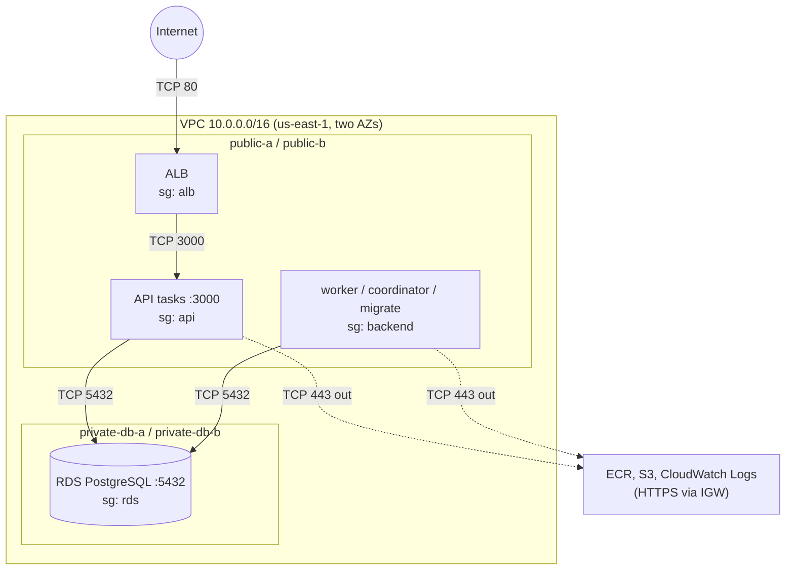

# Cloud architecture (AWS)

How Durable Runner is meant to run on AWS, and how much of that exists.
The distributed-execution design itself (claiming, leases, fencing, retries,
events) is in [architecture.md](architecture.md) and doesn't change here.

## Status

| Layer | Planned | Defined in Terraform (`infra/`) | Deployed |
|---|---|---|---|
| VPC, 4 subnets, IGW, route tables | yes | yes | **yes**, verified 2026-09-24 |
| Security groups (alb, api, backend, rds) | yes | yes | **yes**, verified 2026-09-24 |
| ECR repository `durable-runner` | yes | yes | **yes**, empty (no image pushed) |
| Budget alerts (filtered to `Project` tag) | yes | yes (`enable_budget = true` in local tfvars) | **yes**, verified 2026-09-25 |
| ALB | yes | no | no |
| ECS cluster, Fargate API / worker / coordinator / migration tasks | yes | no | no |
| RDS DB subnet group (private DB subnets) | yes | yes (`rds.tf`, always present) | **yes**, verified 2026-09-25 |
| RDS PostgreSQL 16 instance (`db.t4g.micro`, private) | yes | yes (`rds.tf`, behind `enable_database`) | **yes**, control plane verified 2026-09-25; **SQL connectivity not yet verified** |
| TLS (ACM), DNS (Route 53), CI/CD | later | no | no |

On 2026-09-24 the reviewed plan was applied: 29 added, 0 changed, 0
destroyed. The result was then checked directly with the AWS CLI rather than
trusted from Terraform's output. That covered VPC attributes, the subnets
and their AZs, the IGW attachment, every route, every security-group rule,
ECR settings and tags. An immediate re-plan reported no changes. The two AZs
are `us-east-1a` (`use1-az2`) and `us-east-1b` (`use1-az4`). `terraform
output` (run in `infra/`) prints the resource IDs.

Since 2026-09-25 the RDS instance runs here (see below). It has one
network interface, with private address `10.0.11.44` and no public IP. No
ALB or tasks exist yet, so the alb, api and backend security groups only
define *who would be allowed*.

AWS also created the VPC's *main* route table automatically. Terraform
doesn't manage it, and no subnet uses it; it contains only the local
route.

On 2026-09-25 the `Project` cost allocation tag was activated and the
project-scoped budget applied as a one-resource plan (1 added, 0 changed, 0
destroyed). `aws budgets` shows the filter, limit and three notifications
as configured, and a re-plan reported no changes. With that, the Phase 2A
foundation (network, security groups, ECR and cost guardrail) is complete.

## Target shape



One container image runs every role. The command chosen at launch decides
whether a task is the API, a worker, the coordinator or a one-off migration.

## Network

Region `us-east-1`. VPC `10.0.0.0/16`, DNS support and DNS hostnames on.

| Subnet | CIDR | AZ | Route table | Will hold |
|---|---|---|---|---|
| public-a | 10.0.0.0/24 | 1st standard AZ | public | ALB node, Fargate task ENIs |
| public-b | 10.0.1.0/24 | 2nd standard AZ | public | ALB node, Fargate task ENIs |
| private-db-a | 10.0.10.0/24 | 1st standard AZ | private-db | RDS |
| private-db-b | 10.0.11.0/24 | 2nd standard AZ | private-db | RDS (standby / subnet-group requirement) |

Route tables:

- **public**: `10.0.0.0/16 → local`, `0.0.0.0/0 → internet gateway`.
- **private-db**: `10.0.0.0/16 → local` only.

The two AZs are the first two *standard* zones in the region, sorted by name
(`locals.tf`). They're filtered only on opt-in status, not on "currently
available", so an AZ incident can't reshuffle the list and make Terraform
plan to rebuild subnets. AZ names map to different physical zones in each
account; the plan output shows which names were picked.

### What each piece does

- **VPC**: a private address space (`10.0.0.0/16`, 65,536 addresses) that
  nothing outside can reach unless something inside is given a route and
  permission. Everything else here lives inside it.
- **Subnet**: a slice of that range pinned to one availability zone. Its
  behavior comes from the route table it's associated with, not from its
  name.
- **Two AZs**: an AZ is one or more separate data centers. An ALB must have
  subnets in at least two AZs, and an RDS subnet group must span at least
  two, even for a single-AZ database. It also means losing one zone doesn't
  take out the whole network layout. Each tier therefore gets one subnet per
  AZ.
- **Internet Gateway**: the VPC's single door to the internet. It also
  translates between a resource's private address and its public IPv4
  address. It does nothing for a subnet whose route table doesn't point at
  it.
- **Route tables**: they answer "where does a packet to address X go?" A
  subnet is **public** only because its table has `0.0.0.0/0 → IGW`.
- **Why private-db has no default route**: without a route, the database
  subnets have no internet path in either direction, whatever any security
  group says. The database only needs the VPC-local route to hear from the
  tasks. It is explicitly associated with its own table rather than the VPC
  main table, so a route later added to the main table can't leak into it.

## Security groups

Security groups are stateful allowlists attached to network interfaces.
Routing decides whether a packet *can* get somewhere; the security group
decides whether the receiving (or sending) interface *accepts* it. Both
have to allow it.

| Group | Inbound | Outbound |
|---|---|---|
| alb | TCP 80 from `0.0.0.0/0` | TCP 3000 to **api** |
| api | TCP 3000 from **alb** | TCP 443 to `0.0.0.0/0`; TCP 5432 to **rds** |
| backend | *none* | TCP 443 to `0.0.0.0/0`; TCP 5432 to **rds** |
| rds | TCP 5432 from **api**; TCP 5432 from **backend** | *none* |
| VPC default | *none* (rules removed) | *none* |

Bold names are security-group references: "any interface that belongs to
that group". That expresses the trust boundary directly. Only our tasks can
reach PostgreSQL, and only the ALB can reach port 3000. By contrast,
`10.0.0.0/16` would also admit the ALB or anything added to the VPC later,
and a CIDR can't follow tasks whose IPs change on every deployment.

**Public IP ≠ publicly reachable.** Fargate tasks in the public subnets
will get public IPv4 addresses so they can reach ECR and CloudWatch Logs.
Inbound, a packet from the internet to a task on port 3000 is routed there,
but the api group only accepts 3000 from the alb group, so it's dropped.
Backend tasks accept nothing inbound at all.

**Outbound 443 to anywhere** is deliberate. Without a NAT Gateway or VPC
endpoints, tasks reach AWS service endpoints (ECR API, the S3 buckets behind
image layers, CloudWatch Logs) over the internet. Those endpoints' IP
ranges are large and change, so pinning them isn't practical. The
application itself calls nothing but PostgreSQL. DNS queries to the VPC
resolver aren't filtered by security groups.

**Migrations** run as a one-off task with the **backend** group: they need
PostgreSQL and serve nothing.

## Why public subnets for Fargate, and no NAT Gateway

The textbook layout puts tasks in private subnets behind a NAT Gateway. A
NAT Gateway costs about $0.045/hour (roughly $33/month) plus $0.045 per GB
processed, per AZ, before any traffic. For three small tasks, public IPv4
addresses at $0.005/hour each (about $3.65/month) are much cheaper. The
security groups above keep inbound access exactly as closed as it would be
behind a NAT. What's given up is defense in depth: in this layout a single
security-group mistake exposes a task, whereas behind a NAT it wouldn't.
Moving tasks to private subnets later means adding private app subnets plus
a NAT Gateway or VPC endpoints.

## Why RDS is private

The database holds all task state and is the only thing every process talks
to. It sits in subnets with no internet route, accepts only 5432 from the
api and backend groups, and gets no public address. There's no rule for a
laptop; reaching it for debugging will go through a task inside the VPC.

## RDS PostgreSQL (deployed; SQL connectivity not yet verified)

`infra/rds.tf` defines one instance and its DB subnet group. On 2026-09-25
the reviewed saved plan was applied: 2 added (`aws_db_subnet_group.main`,
`aws_db_instance.main[0]`), 0 changed, 0 destroyed. The instance took about
7 minutes to become available. It was then checked with the AWS CLI, and
an immediate re-plan reported no changes.

What AWS reports:

- `durable-runner-dev`: PostgreSQL **16.13** (RDS's default 16.x;
  `engine_version = "16"` doesn't drift against it), `db.t4g.micro`,
  single-AZ in **us-east-1b** (`private-db-b`).
- 20 GiB gp3 at the 3000 IOPS / 125 MiB/s baseline, encrypted with
  `alias/aws/rds` (AWS-managed).
- `PubliclyAccessible = false`. Its one network interface has private IP
  `10.0.11.44` and no public IP. The endpoint hostname resolves to that
  private address.
- Subnet group: exactly `private-db-a` and `private-db-b`, whose route table
  has only the local route.
- Only the `rds` security group. It admits 5432 only from the api and
  backend groups, and no rule in the VPC opens 5432 to the internet.
- 1-day backups, deletion protection off, automatic minor upgrades on,
  default `postgres16` parameter group (`rds.force_ssl = 1`), CA
  `rds-ca-rsa2048-g1`.
- Managed master secret `rds!db-…`: owned by RDS, rotated every 7 days,
  encrypted with `alias/aws/secretsmanager`. Its value was never read. The
  Terraform state holds only the ARN, with no password or URL.

**SQL connectivity has not been verified, and no migrations have run.** No
SQL client has connected. The first real test will be a one-off Fargate
task in the backend security group.

| Setting | Value | Why |
|---|---|---|
| Engine | PostgreSQL, `engine_version = "16"` with auto minor upgrades | Local development and the benchmarks use 16. Specifying only the major version lets RDS pick its default minor (16.13 at planning time; 16.3–16.15 were available) and apply later minors without Terraform drift. `engine_version_actual` reports what's running. |
| Class | `db.t4g.micro` (2 burstable vCPUs, 1 GiB) | Orderable for 16.x in both of our AZs. It's the smallest Graviton class. |
| Availability | single-AZ | The two-AZ subnet group is an RDS requirement, not a standby. |
| Storage | 20 GiB gp3 (baseline 3000 IOPS / 125 MiB/s), autoscaling off | gp3 minimum; storage and its cost can't grow on their own. |
| Encryption | on, AWS-managed `aws/rds` key | No customer-managed KMS key. |
| Database / admin user | `durable_runner` / `durable_runner_admin` | The admin name is distinct from the database name and isn't `postgres`. |
| Credentials | `manage_master_user_password = true` | RDS generates the password into a Secrets Manager secret it owns. No password in config, tfvars, state or outputs; state holds only the secret's ARN. Rotated every 7 days by default. |
| Network | DB subnet group = the two private DB subnets; `rds` security group only; `publicly_accessible = false` | See below. |
| Backups | 1 day | Point-in-time restore for the length of an experiment. Backup storage up to the provisioned size carries no extra charge. |
| Teardown | `deletion_protection = false`, `skip_final_snapshot = true`, automated backups deleted with the instance | Built for create → test → destroy. **Not** production defaults: a real database would keep deletion protection and a final snapshot. |
| Extras | no Multi-AZ, Enhanced Monitoring, Performance Insights, RDS Proxy or replicas | No current requirement. |

**A DNS name doesn't mean it's public.** The instance gets a hostname like
`durable-runner-dev.xxxx.us-east-1.rds.amazonaws.com`. With
`publicly_accessible = false` it resolves only to a private `10.0.x.x`
address in a DB subnet. That address has no internet route, and the `rds`
group admits 5432 only from the `api` and `backend` groups. Anyone can
resolve the name, but only our tasks can connect.

**Future `DATABASE_URL` (ECS phase, not implemented).** The app reads a
single `DATABASE_URL`. The pieces come from two places:

- non-secret, from Terraform outputs (`db_address`, `db_port`, `db_name`,
  `db_username`), which go into the task definition as plain environment
  values;
- secret, the password from the RDS-managed secret
  (`db_master_user_secret_arn`, expected to be a JSON value with `username`
  and `password` keys; check the key names, not the values, after apply). ECS injects it as an environment variable at task start via
  the task definition's `secrets`. That needs an execution role allowed to
  read that secret.

Since the app wants one URL, the container has to assemble it at startup.
That can be a small shell wrapper in the task command, or the app reading
`PGPASSWORD` next to a password-less URL. That's a decision for the ECS
phase. Three constraints for that phase:

1. **TLS is mandatory.** The default `postgres16` parameter group sets
   `rds.force_ssl = 1`. In the installed `pg` 8.23 / `pg-connection-string`
   2.14, `sslmode=require` means full certificate verification, and the
   Amazon RDS CA isn't in Node's default trust store. So a bare
   `?sslmode=require` URL would fail certificate verification. The fix is
   to ship the RDS CA bundle in the image (for example via
   `NODE_EXTRA_CA_CERTS`) and use `sslmode=verify-full`. `no-verify` would
   also connect, but it gives up server authentication. Not done yet,
   because it can't be tested until something runs inside the VPC.
2. **Rotation vs injected secrets.** ECS injects the secret once, at task
   start. After a 7-day rotation, long-running tasks would still have the
   old password, and new pool connections would fail. For short
   experiments this doesn't come up. For anything longer, tasks need to be
   restarted after rotation, or rotation lengthened.
3. The password can contain URL-reserved characters, so it must be
   percent-encoded when the URL is built.

**Secret tags.** The secret is created by RDS, not Terraform, but it does
carry the instance's tags (`Project=durable-runner-dev`,
`ManagedBy=terraform`) along with RDS's own `aws:rds:*` tags. So its
~$0.40/month counts toward the tag-filtered budget.

### Database lifecycle: `enable_database`

Only the billable instance is conditional. The DB subnet group costs
nothing, holds no data or credentials, and records where the database
lives, so it stays deployed with the rest of the network.

| `enable_database` | DB subnet group | RDS instance |
|---|---|---|
| `false` (the variable's default) | exists | does not exist |
| `true` (set in the local, gitignored `infra/terraform.tfvars`) | exists | exists |

- **false → true** creates `aws_db_instance.main[0]` inside the existing
  subnet group: an empty database, with a new RDS-managed secret. Migrations
  have to run again.
- **true → false** plans `0 to add, 0 to change, 1 to destroy`, and the one
  resource is `aws_db_instance.main[0]`. The subnet group, VPC, security
  groups, ECR and budget are untouched. **This permanently deletes the
  database and all its data.** This development instance skips the final
  snapshot and deletes its automated backups with the instance, so nothing
  is left to restore from. That's intended for experiments, and wrong for
  anything whose data matters.
- With the instance off, the `db_*` outputs are `null`.

This toggle is the normal way to add or remove the database between
experiments. `terraform destroy -target=...` is an emergency or debugging
tool, not part of the routine lifecycle.

Terraform only owns what's in its state, so neither path can touch other
databases in the account (there are none today). A bare `terraform
destroy`, by contrast, removes *everything* in `infra/`: VPC, security
groups, ECR, budget and database.

## ECR

One private repository, `durable-runner`, for the single image.

- **Tags are immutable.** Deployments will tag images with the Git commit
  SHA, so a tag always names the same bytes and a rollback to an old SHA
  gets the old image. The trade-off is that `latest` can't be re-pushed.
- **Basic scan on push.** Findings are informational only and don't block
  a push or a deploy.
- **Encryption** uses AES256 (AWS-managed), not a customer-managed KMS key.
- **Lifecycle:** only *untagged* images are expired, after 14 days. Every
  SHA-tagged image is kept.
- **Teardown:** `force_delete` is off, so `terraform destroy` refuses to
  remove a repository that still holds images.

## Cost

A `terraform plan` provisions nothing and costs nothing. Figures below are
us-east-1 on-demand list prices checked in September 2026, before any
free-tier credits.

**This foundation (deployed):**

| Item | Cost while it exists |
|---|---|
| VPC, subnets, route tables, IGW, security groups | no charge |
| AWS Budget (no actions) | free |
| ECR storage | $0.10/GB-month; at roughly 0.1–0.15 GB compressed per image, cents per month for dozens of images. Pulls by Fargate in the same region are free. |
| RDS (while `enable_database = true`) | db.t4g.micro $0.016/h + 20 GB gp3 $0.115/GB-month + managed secret $0.40/month ≈ $14.40/month (≈ $0.47/day). Backups within the 20 GB allowance and the private-only network add nothing. Setting `enable_database = false` stops it. |
| Public IPv4 | none yet: nothing in this foundation gets a public address |

**Later, when compute and database exist (not being provisioned now).**
Rough 24/7 monthly figures:

| Item | Assumption | ≈ per month |
|---|---|---|
| ALB | $0.0225/h + ~1 LCU at $0.008/h | $17–23 |
| ALB public IPv4 | 2 addresses (one per AZ) | $7 |
| Fargate | 3 tasks × 0.25 vCPU / 0.5 GB, ARM64 | $22 (x86 ≈ $27) |
| Task public IPv4 | 3 addresses | $11 |
| RDS PostgreSQL | already deployed; counted in the table above | ($14.40) |
| CloudWatch Logs | low volume | a few $ |
| **Total** | | **≈ $70–85** |

That is above the $50 budget. Running everything around the clock isn't the
plan: the intent is to scale services to zero or tear the stack down when
it isn't being used, and the budget alerts are there to catch forgetting.

## Cost guardrail

`infra/budget.tf` defines one monthly cost budget that counts only
resources tagged `Project = durable-runner-dev`:

- $50 limit;
- an email when actual spend passes $20, when the forecast passes $50, and
  when actual spend passes $50.

It is filtered by tag because the AWS account also holds unrelated
projects, whose spend shouldn't trip these alerts. AWS Budgets can only
filter on a tag that has been activated as a cost allocation tag in
Billing, and a tag can only be activated once AWS has seen it on a
resource. So the budget is behind `enable_budget` (default `false`), and
was brought up in three steps, all done:

1. First apply with `enable_budget = false`: tagged resources exist, no
   budget.
2. Activate the `Project` cost allocation tag (done 2026-09-25 with
   `aws ce update-cost-allocation-tags-status`; the console works too). A tag
   key usually shows up there within 24 hours of first use. In this account
   the `Project` key was already listed as inactive (last used 2026-09-01,
   before these resources existed), so something else in the account uses
   the same key. Activation is by key, and the budget filters on the
   exact value `durable-runner-dev`, so other projects' `Project` values
   aren't counted.
3. Apply with `enable_budget = true` and `budget_alert_email` set (done
   2026-09-25). The budget is `durable-runner-dev-monthly`.

The alert address comes from `budget_alert_email`, supplied through
`infra/terraform.tfvars` (gitignored) or `TF_VAR_budget_alert_email`.
It's required only when the budget is enabled.

This is an **alarm, not a cap**. AWS Budgets stops nothing, and billing
data lags by hours. It also doesn't see untagged spend. Newly activated
tags can take up to a day to show in cost data, so the budget may
under-report at first. The `enable_budget = true` setting lives only in
the gitignored `infra/terraform.tfvars`: running Terraform without that
file would plan to delete the budget.

## Terraform state

State is local (`infra/terraform.tfstate`, gitignored). This is a
one-person, one-laptop environment, and a remote backend would itself need
an S3 bucket created first. The costs of local state:

- no protection against two runs at once;
- losing the file means Terraform no longer knows what it created, which
  leaves orphaned resources to find by the `Project` tag;
- state stores variable values, including the budget email, in plaintext.

Since the 2026-09-24 apply this file is the only record of what Terraform
owns in AWS. Don't delete it, and keep a copy somewhere safe.

If more than one machine or a CI job ever runs Terraform, move state to S3
with `use_lockfile`.

## Using it

```bash
cd infra
cp terraform.tfvars.example terraform.tfvars   # enable_budget, budget_alert_email
terraform init
terraform validate
terraform plan
```
